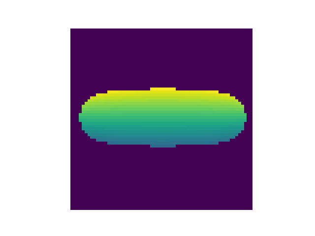

# About this project

This Python script generates the animation of a spinning torus illuminated by a custom light source.

# TODO
- [ ] Add docstrings besides the standard comments
- [ ] Include more shapes, i.e. cubes
- [ ] Optimize
- [ ] Describe maths in README
